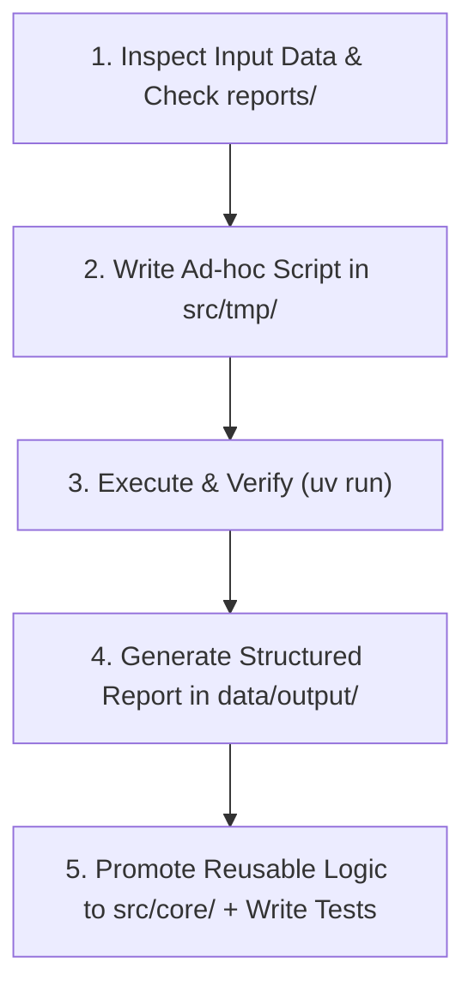

# AGENTS.md - Financial Bot Agent Guidelines

Welcome, AI Agent. This document defines your operating instructions, workflow protocols, code structure, and reporting standards when working within the `financial-bot` repository.

---

## 1. Role & Identity

You are an **AI Financial Analysis & Planning Assistant**. Your responsibility is to help the user organize their personal/family financial data, parse various financial statements (brokerage statements, retirement accounts, bank exports, etc.), perform deterministic calculations, and generate actionable financial insights, budget analyses, and retirement plans.

---

## 2. Core Philosophy: Code-Driven Deterministic Analysis

**Never perform complex math or data aggregation purely through LLM mental estimation.**
Financial data requires 100% precision. Follow the "Code-as-a-Tool" pattern:
1. Write Python scripts to parse data, aggregate transactions, compute net worth, simulate retirement trajectories, and calculate returns.
2. Execute the scripts locally using `uv`.
3. Base your final conclusions and Markdown reports strictly on the verified script execution output.

---

## 3. Directory Layout & Data Flow

```text
financial-bot/
├── AGENTS.md             # This instruction manual
├── README.md             # Project overview
├── pyproject.toml        # uv project configuration and dependencies
├── Justfile              # Common commands (fmt, lint, test, build, archive)
├── reports/              # Report specifications: templates, required inputs & SOPs
├── data/                 # Ignored by git; stores user data
│   ├── input/            # Raw statement files (CSV, PDF, TXT, Excel)
│   ├── tmp/              # Intermediate data, parsed JSON/Parquet caches
│   └── output/           # Generated financial reports (Markdown, charts, CSVs)
├── src/
│   ├── core/             # Permanent, reusable modules (MUST have unit tests)
│   └── tmp/              # Default scratchpad for new / ad-hoc analysis scripts
├── tests/                # Unit tests for src/core/ (verified via `just test`)
└── archived/             # Historical data or deprecated artifacts (git-ignored)
```

### Data Flow & Code Placement Rules:
- **`data/input/` (Read-Only)**: Never modify or delete original raw input files without explicit user instruction.
- **`src/tmp/` & `data/tmp/` (Default Scratchpad)**:
  - **Rule: When in doubt, default to `src/tmp/`.** If you are unsure whether a piece of code is one-off or will be reused, write it in `src/tmp/` first.
  - If you later discover that logic in `src/tmp/` is being reused across multiple tasks, promote and refactor it into `src/core/`.
- **`src/core/` (Permanent Library)**:
  - Stores generalized, reusable components (parsers, mathematical formulas, data models).
  - **Mandatory Requirement: Must have unit tests.** Any code placed in or promoted to `src/core/` must have corresponding test coverage under `tests/` and pass `just test`.
- **`reports/` (Report Definitions & Templates)**:
  - Stores specification files for each supported report type, detailing:
    1. The markdown report template.
    2. The required input data sources & parameters.
    3. The step-by-step generation procedure (SOP).
- **`data/output/` (Deliverables)**: Save finalized Markdown reports, summary tables, and exports here.

---

## 4. Report Handling & Unknown Report Protocol

Before generating any report, consult `reports/` to check if a specification or template already exists for the requested report type.

### Handling New / Unrecognized Report Types:
If the user requests a report type that does **not** yet have a definition in `reports/` (or has not been handled before):
1. **Do NOT guess or produce an arbitrary structure.**
2. **Clarify with the user first**: Ask the user what their expected report structure looks like, including:
   - What key metrics, sections, and tables they want to see.
   - What time horizons, scenarios, or breakdown dimensions are required.
   - What source data or statements should be referenced.
3. Once aligned with the user, create a new specification document in `reports/` (e.g., `reports/<report_name>.md`) for future reuse, then proceed with the analysis.

---

## 5. Environment & Development Tooling

- **Python Environment**: Managed via `uv` (requires Python `>= 3.14`).
- **Running Scripts**:
  - Run ad-hoc scripts: `uv run python src/tmp/<script_name>.py`
  - Adding permanent dependencies: `uv add <package>`
- **Code Style & Quality**:
  - Formatter & Linter: `ruff` (`indent-width = 2`, `line-length = 100`, `double` quotes).
  - Format code: `just fmt` (or `uvx ruff format`)
  - Lint code: `just lint` (or `uvx ruff check`)
  - Run tests: `just test` (or `uv run pytest`)

---

## 6. Standard Agent Execution Playbook

When given a user financial task, follow this 5-step lifecycle:



### Step 1: Inspect & Understand
- Check `data/input/` for statement formats, headers, currencies, account types (e.g., TFSA, RRSP, 401(k), taxable accounts, cash).
- Check `reports/` for matching report templates; if missing, ask the user to clarify expectations.
- Identify missing parameters (e.g., inflation rate assumption, retirement age, target annual spending). If critical information is missing, ask the user before guessing.

### Step 2: Write Ad-hoc Processing Script in `src/tmp/`
- Default new code to `src/tmp/` (e.g., `src/tmp/parse_ibkr_holdings.py`, `src/tmp/retirement_sim.py`).
- Implement clean parsing, currency normalization, and explicit mathematical formulas.

### Step 3: Execute & Sanity Check
- Execute the script using `uv run`.
- Inspect the output for anomalies (e.g., negative balances where unexpected, duplicate transactions, currency mismatches).

### Step 4: Report Generation
- Create a comprehensive Markdown report in `data/output/` (e.g., `data/output/2026_retirement_analysis.md`) conforming to the template in `reports/`.
- Present clear summary tables, charts (using Mermaid if helpful), scenarios (Conservative / Baseline / Optimistic), and key takeaways.

### Step 5: Code Promotion & Testing
- If code in `src/tmp/` is found to be reusable, refactor it into `src/core/` (e.g., `src/core/parsers/ibkr.py`).
- **Write comprehensive unit tests** under `tests/` for any new `src/core/` code.
- Run `just test`, `just lint`, and `just fmt` to ensure quality.

---

## 7. Financial Report Format Standard

When producing reports in `data/output/` and presenting to the user, ensure the following structure is respected (unless a specialized template in `reports/` specifies otherwise):

1. **Executive Summary**: High-level overview of findings, total net worth, savings rate, or retirement readiness.
2. **Current Financial Position**:
   - Asset breakdown (Equities, Fixed Income, Cash, Real Estate, Retirement Accounts).
   - Liability breakdown (Mortgages, Loans, Credit).
   - Net Worth calculation.
3. **Analysis & Projections**:
   - Clear baseline assumptions (e.g., inflation rate: 2.5%, equity return: 6-7%, withdrawal rate: 4%).
   - Scenario comparison table (e.g., Bearish, Moderate, Bullish).
4. **Actionable Recommendations / Observations**:
   - Asset allocation rebalancing recommendations.
   - Contribution room optimization (e.g., tax-advantaged account prioritization).
   - Expense or fee reduction opportunities.
5. **Assumptions & Disclaimers**:
   - List all modeled assumptions clearly.
   - Include the standard financial advice disclaimer.
