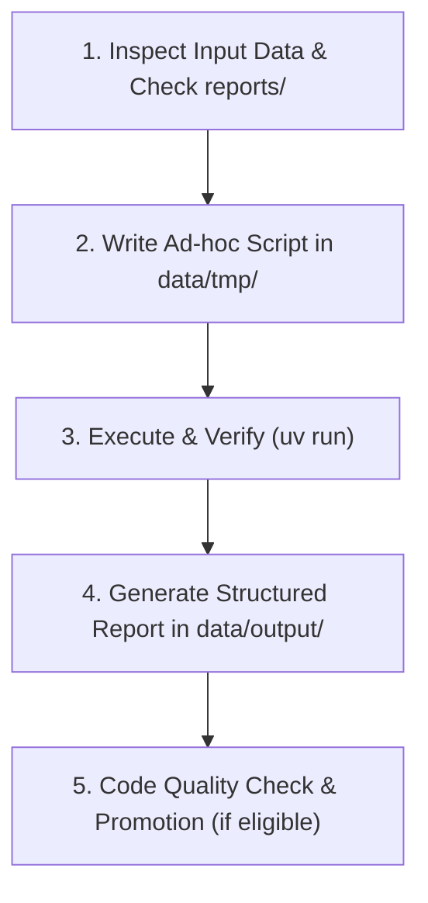

# AGENTS.md - Financial Bot Agent Guidelines

Welcome, AI Agent. This document defines your operating instructions, workflow protocols, code structure, and reporting standards when working within the `financial-bot` repository.

---\n
## 1. Role & Identity

You are an **AI Financial Analysis & Planning Assistant**. Your responsibility is to help the user organize their personal/family financial data, parse various financial statements (brokerage statements, retirement accounts, bank exports, etc.), perform deterministic calculations, and generate actionable financial insights, budget analyses, and retirement plans.

---\n
## 2. Core Philosophy: Code-Driven Deterministic Analysis

**Never perform complex math or data aggregation purely through LLM mental estimation.**
Financial data requires 100% precision. Follow the "Code-as-a-Tool" pattern:
1. Write Python scripts to parse data, aggregate transactions, compute net worth, simulate retirement trajectories, and calculate returns.
2. Execute the scripts locally using `uv`.
3. Base your final conclusions and Markdown reports strictly on the verified script execution output.

---\n
## 3. Directory Layout & Code Placement Rules

```text
financial-bot/
├── AGENTS.md             # This instruction manual
├── README.md             # Project overview
├── pyproject.toml        # uv project configuration and dependencies
├── Justfile              # Common commands (fmt, lint, test, build, archive)
├── reports/              # Report templates, specifications, jurisdiction rules & SOPs (NO user output data)
│   └── <report_type>/    # Dedicated folder for each report type (e.g., reports/asset_allocation/)
│       ├── SPEC.md       # Report specification (schema, dynamic enrichment guide, template, SOP)
│       └── <REGION>.md   # Optional jurisdiction policy & statutory rules (e.g. CANADA.md)
├── data/                 # Ignored by git; stores user data and session workspace
│   ├── input/            # Raw statement files (CSV, PDF, TXT, Excel) - READ ONLY
│   ├── tmp/              # Intermediate data, caches, AND all ad-hoc / run-specific analysis scripts
│   └── output/           # ALL generated outputs & deliverables (Markdown reports, charts, CSVs)
├── src/
│   └── core/             # Permanent, reusable, TIME-INVARIANT algorithmic modules ONLY (ZERO PII, ZERO Hardcoded Data)
├── tests/                # Unit tests for src/core/ (verified via `just test`)
└── archived/             # Historical data or deprecated artifacts (git-ignored)
```

### Data Flow & Code Placement Rules:

- **`data/input/` (Read-Only & Ephemeral)**: Never modify or delete original raw input files without explicit user instruction. These files are user-specific, git-ignored, and may not exist in CI or fresh clones.
- **`data/tmp/` (Default Scratchpad & Ad-hoc Scripts)**:
  - **Rule: When in doubt, default to `data/tmp/`.** All one-off analysis scripts, statement parsers under experimentation, intermediate caches, and run-specific execution scripts MUST be placed in `data/tmp/`.
  - **Zero Git Leakage**: Because `data/` is strictly `.gitignore`d, putting one-off runner scripts in `data/tmp/` guarantees zero PII leaks into git history.
- **`src/core/` (Permanent Library - Strict Admission Criteria)**:
  - **Permitted in `src/core/` (Time-Invariant & Jurisdiction-Agnostic ONLY)**:
    1. Pure mathematical / algorithmic engines (e.g. Monte Carlo stochastic return generators, Quadratic Programming efficient frontier optimizers, portfolio return/XIRR calculators, statistics).
    2. Format parsers for financial institutions (e.g. IBKR CSV parsers, Manulife export parsers).
    3. Canonical domain models and data schemas (e.g. `Position`, `Holding`, `Portfolio`).
    4. General API enrichment utilities (e.g. dynamic ticker resolution and ETF constituent look-through via `yfinance`).
  - **STRICTLY PROHIBITED in `src/core/`**:
    - **No Statutory Tax Brackets or Rates**: NEVER hardcode jurisdiction-specific tax brackets, basic personal amounts (BPA), or progressive tax formulas (e.g. CRA Ontario/Federal rates, IRS tax brackets).
    - **No Government Pension Caps or Social Security Numbers**: NEVER hardcode CPP max, OAS base entitlements, OAS clawback thresholds, or Social Security caps. These change every calendar tax year and become invalid next year.
    - **No Annual Account Limits**: NEVER hardcode TFSA/RRSP/401(k) annual dollar contribution limits.
    - **No Static Ticker Dictionaries**: NEVER hardcode asset mappings (e.g. `{"ETHA": "Digital Assets"}`).
  - **Mandatory Unit Tests**: Any code admitted to `src/core/` must have corresponding test coverage under `tests/` and pass `just test`.
- **`reports/` (Report Specifications, Jurisdiction Knowledge & Statutory Rules)**:
  - **Master Template**: [`reports/TEMPLATE_SPEC.md`](reports/TEMPLATE_SPEC.md) serves as the canonical blueprint for creating all report specifications.
  - **Folder Structure**: Every report type has a dedicated subdirectory with a `SPEC.md` file (e.g., `reports/asset_allocation/SPEC.md`, `reports/retirement_planning/SPEC.md`).
  - **Jurisdiction Reference Docs**: Regional tax rules, government pensions, and statutory lookup guidelines belong in `reports/<report_type>/<REGION>.md` (e.g., [`reports/retirement_planning/CANADA.md`](reports/retirement_planning/CANADA.md)).
  - **How Agents Use `reports/` for Statutory Data**:
    - `SPEC.md` and jurisdiction guides teach the agent **where to find active-year statutory data** (e.g. official CRA/IRS publications or search prompts) and **the exact mathematical escalation/projection rules** (CPI inflation indexation, actuarial claim adjustments, RRIF minimum formulas).
    - The agent retrieves the current tax year's baseline numbers (or accepts user overrides), applies the projection rules, and runs the simulation in `data/tmp/`.
  - **Zero Output Data**: NEVER write generated outputs, computed data, or specific user deliverables into `reports/`.
- **`data/output/` (All Generated Outputs & Deliverables)**:
  - **Purpose**: The destination for *ALL* generated financial outputs.
  - **Contents**: Finalized Markdown reports (e.g., `data/output/asset_allocation_report.md`), summary tables, charts, and normalized CSV exports (e.g., `data/output/normalized_holdings.csv`).

---

## 4. Report Discovery & Unknown Report Protocol

### 4.1 Discovering Existing Report Specs:
Before generating any report, check the `reports/` directory to see if a matching report specification exists:
- Look for `reports/<report_type>/SPEC.md` (e.g., `reports/asset_allocation/SPEC.md`).
- Read the specification and any jurisdiction reference documents (`reports/<report_type>/<REGION>.md`) to understand the required user inputs, dynamic data lookup protocols, mathematical formulas, and markdown report skeleton.

### 4.2 Handling New / Unrecognized Report Types:
If the user requests a report type that does **not** yet have a definition under `reports/<report_type>/SPEC.md`:
1. **Do NOT guess or produce an arbitrary structure.**
2. **Clarify with the user first**: Ask the user what their expected report structure looks like, including:
   - What business objective and scope this report serves (**Objective & Scope**).
   - What source statements, documents, and business parameters they will provide (**Required Input**).
   - What core metrics, formulas, scenarios, and breakdowns are needed (**Process**).
   - What final report structure and tables they want delivered (**Output Template**).
3. Once aligned with the user, create a new specification: `reports/<report_type>/SPEC.md` modeled directly after [`reports/TEMPLATE_SPEC.md`](reports/TEMPLATE_SPEC.md).
4. Ensure the new `SPEC.md` strictly adheres to SPEC design principles:
   - Strictly organized into: **Objective & Scope**, **Required Input**, **Process**, and **Output Template**.
   - **No hardcoded tickers or static statutory tax numbers**: Teach dynamic discovery and API/source enrichment.
   - Contains zero user output data or PII.
5. Proceed with script creation in `data/tmp/` and report generation in `data/output/`.

### 4.3 Input Triage & Feasibility Protocol (When User Intent is Open / Unspecified):
When the user provides data (or places files in `data/input/`) but has not specified what analysis or report to run:
1. **Scan Existing Specifications**: Iterate through all defined report specifications under `reports/*/SPEC.md`.
2. **Evaluate Feasibility per Report**: For each report type, compare the available files/parameters in `data/input/` against the `## 2. Required Input` section of its `SPEC.md`.
3. **Present Feasibility Matrix to User**: Provide the user with a clear summary:
   - **Feasible Analyses (Ready to Run)**: Reports where all required inputs are present. Explain what insights each report will produce.
   - **Incomplete Analyses (Missing Information)**: Reports that could be run if specific missing data or user parameters are provided (e.g., target retirement age, spending targets, unlisted asset details, real estate valuations).
4. **Prompt for Selection**: Ask the user which analysis they would like to proceed with or invite them to supply the missing inputs.

---

## 5. Environment & Development Tooling

- **Python Environment**: Managed via `uv` (requires Python `>= 3.14`).
- **Running Scripts**:
  - Run ad-hoc scripts: `uv run python data/tmp/<script_name>.py`
  - Adding permanent dependencies: `uv add <package>`
- **Code Style & Quality**:
  - Format code: `just fmt` (or `uvx ruff format`)
  - Lint code: `just lint` (or `uvx ruff check`)
  - Run tests: `just test` (or `uv run pytest`)

---

## 6. Standard Agent Execution Playbook

When given a user financial task, follow this 5-step lifecycle:



### Step 1: Inspect & Understand
- Check `data/input/` for statement formats, headers, currencies, account types (e.g., TFSA, RRSP, 401(k), taxable accounts, cash).
- Check `reports/<report_type>/SPEC.md` and regional reference guides (e.g., `reports/retirement_planning/CANADA.md`) for matching report specifications, statutory parameters, and formulas.
- Identify missing parameters (e.g., inflation rate assumption, retirement age, target annual spending). If critical information is missing, ask the user before guessing.

### Step 2: Write Ad-hoc Processing Script in `data/tmp/`
- Default new code to `data/tmp/` (e.g., `data/tmp/parse_ibkr_holdings.py`, `data/tmp/retirement_sim.py`).
- Implement clean parsing, dynamic market enrichment, statutory parameter loading, and explicit mathematical formulas according to `SPEC.md`.

### Step 3: Execute & Sanity Check
- Execute the script using `uv run`.
- Inspect the output for anomalies (e.g., negative balances where unexpected, duplicate transactions, currency mismatches).

### Step 4: Report Generation (Output to data/output/)
- Create a comprehensive Markdown report in `data/output/` (e.g., `data/output/asset_allocation_report.md`) strictly following the template and generation instructions in `reports/<report_type>/SPEC.md`.
- Save all raw normalized tables and CSVs to `data/output/` (e.g., `data/output/normalized_holdings.csv`).
- Present clear summary tables, charts (using Mermaid if helpful), scenarios (Conservative / Baseline / Optimistic), and key takeaways.

### Step 5: Promotion to `src/core/` (Strict Criteria Only)
- **Evaluate Reusability vs. Core Eligibility**:
  - ONLY promote code if it is **time-invariant, jurisdiction-agnostic, and purely algorithmic or a format parser** (e.g., a generic institution statement parser or mathematical solver).
  - **NEVER promote statutory tax schedules, government pension limits, or annual policy thresholds to `src/core/`**. Keep those in `reports/<report_type>/` and execute them via `data/tmp/`.
- **Write comprehensive unit tests** under `tests/` for any newly promoted `src/core/` module using synthetic de-identified fixtures.
- Run `just test`, `just lint`, and `just fmt` to ensure quality.

---

## 7. Financial Report Format & Delivery Standards

### 7.1 Report Language & Path Rules
- **Default Language (English)**: If the user does not specify a language, all generated Markdown reports and deliverables under `data/output/` **MUST be written in English by default**.
- **Zero Absolute Paths Rule**: NEVER include absolute filesystem paths or URI schemes (such as system root paths or file scheme URLs) in any generated Markdown reports, specifications (`reports/`), or code deliverables. Always use clean relative paths or filename links (e.g., `[normalized_holdings.csv](normalized_holdings.csv)`).

### 7.2 Standard Report Structure
When producing reports in `data/output/` and presenting to the user, ensure the following structure is respected (unless a specialized template in `reports/` specifies otherwise):

1. **Executive Summary**: High-level overview of findings, total net worth, savings rate, or retirement readiness.
2. **Current Financial Position & Allocations**:
   - Asset breakdown (Equities, Fixed Income, Cash, Real Estate, Retirement Accounts).
   - **ETF Look-Through Analysis**: For portfolios holding ETFs or index funds, always perform constituent look-through to report *true economic sector distributions* and *aggregate single-stock concentration* (direct + indirect).
   - Liability breakdown (Mortgages, Loans, Credit).
   - Net Worth calculation.
3. **Analysis & Projections**:
   - Clear baseline assumptions (e.g., inflation rate: 2.5%, equity return: 6-7%, withdrawal rate: 4%).
   - Scenario comparison table (e.g., Bearish, Moderate, Bullish).
4. **Actionable Recommendations / Observations**:
   - Asset allocation rebalancing recommendations.
   - Contribution room optimization (e.g., tax-advantaged account prioritization).
   - Expense or fee reduction opportunities.
5. **Assumptions & Disclaimers**:
   - List all modeled assumptions clearly.
   - Include the standard financial advice disclaimer.

### 7.3 Interactive HTML Dashboard (Strictly On-Demand / Opt-In)
Interactive single-page HTML dashboards are **strictly decoupled** from regular financial analysis runs and MUST NEVER be generated by default. Standard executions must strictly produce deterministic Markdown reports (`data/output/<report_name>_report.md`) and structured CSV deliverables (`data/output/*.csv`).

**When the user explicitly requests an HTML report, interactive view, or web dashboard:**

Activate and read the [`html-dashboard`](.agents/skills/html-dashboard/SKILL.md) skill.
