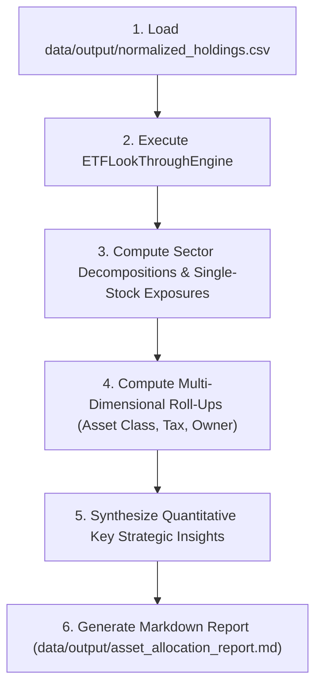

# Portfolio Asset Class & Sector Allocation Report Specification

This specification defines the objective and scope, user-provided inputs, ETF constituent look-through decomposition methodology, multi-dimensional aggregation rules, standard operating procedure (SOP), and deliverable report template for generating the Asset Class and Sector Allocation Report within `financial-bot`.

---

## 1. Objective & Scope

The Asset Class & Sector Allocation Report provides a strategic, portfolio-wide view of an investor's overall asset distribution and true economic risk exposures.

### Core Objectives:
1. **Strategic Asset Allocation**: Group normalized holdings into canonical asset classes (US Equities, Canadian Equities, International Equities, Fixed Income, Digital Assets, Cash & Equivalents).
2. **True Economic Sector Look-Through**: Decompose broad index ETFs and thematic funds to report actual underlying economic sector exposures across the 11 GICS sectors.
3. **Aggregate Single-Stock Concentration**: Penetrate ETF holdings to compute true consolidated single-stock exposures (combining direct individual equity holdings and indirect ETF constituents).
4. **Tax & Ownership Distribution**: Analyze capital distribution across tax categories (`Taxable`, `Tax-Free`, `Tax-Deferred`) and family/individual account owners.
5. **Deliverable Production**: Generate a structured, publication-grade Markdown report at `data/output/asset_allocation_report.md`.

---

## 2. Required Input

Defines what the **user** must provide to the system prior to generating the allocation report.

### 2.1 Source Statements & Data Files (in `data/input/`)
- **Statement Types**: Brokerage statements, account export CSVs, institutional retirement plan summaries, or crypto wallet exports.
- **Coverage**: All active accounts and cash holdings to be included in the total net worth calculation.
- **Upstream Dependency**: Alternatively, the consolidated holding dataset `data/output/normalized_holdings.csv` produced by the portfolio normalization pipeline (see `reports/portfolio_normalization/SPEC.md`).
- *Note: Statement formats vary across institutions; ingestion parsers in Process handle normalization into a uniform schema.*

### 2.2 User Parameters & Assumptions
- **Base Currencies**: Preferred dual reporting currencies (defaults to `USD` and `CAD`).
- **Custom Fund / Asset Overrides**: Descriptions or benchmark proxies for private / unlisted employer funds (e.g., matching an internal fund code to the S&P 500 or MSCI EAFE index).

---

## 3. Process

Defines the complete end-to-end technical, enrichment, and calculation workflow.

### 3.1 Multi-Source Ingestion & Data Standardization
- Ingest raw statements or read `data/output/normalized_holdings.csv`.
- Standardize all holding records into canonical dimensions:
  - Account identification: `source`, `account_id`, `account_label`, `owner`, `account_type`, `tax_treatment`.
  - Position metadata: `symbol`, `asset_name`, `asset_class`, `asset_subclass`, `sector`, `industry`, `currency`.
  - Valuation: `quantity`, `close_price_local`, `cost_basis_local`, `market_value_local`, `unrealized_pl_local`, `market_value_usd`, `cost_basis_usd`, `unrealized_pl_usd`, `market_value_cad`, `cost_basis_cad`, `unrealized_pl_cad`.

### 3.2 Dynamic Market Data & ETF Look-Through Enrichment
ETFs and mutual funds represent bundled baskets of underlying securities. Direct asset reporting creates opacity because an investor holding multiple ETFs may have massive hidden concentrations in individual mega-cap equities or specific sectors.

- **Public ETFs / Funds**: Dynamically query market data APIs (e.g., `yfinance.Ticker(symbol).funds_data`):
  - `sector_weightings`: Dictionary of sector weights $\{S_k: W_{\text{sector}}(e, S_k)\}$.
  - `top_holdings`: Table of constituent symbols, company names, and weights $\{T_i: (N_i, W_{\text{holding}}(e, T_i))\}$.
- **Unlisted / Institutional Funds**: For employer retirement plans lacking public tickers, dynamically inject a benchmark profile matching the underlying tracked index composition via `custom_fund_profiles`.
- **Dynamic FX Rates**: Query real-time FX rates (e.g., `USDCAD=X`) or extract stated exchange rates to value all assets in USD and CAD.

### 3.3 Mathematical Models & Aggregation Algorithms

#### A. Multi-Dimensional Portfolio Aggregations
- **Portfolio Totals**:
  - Total Net Worth: $\text{TotalUSD} = \sum \text{market\_value\_usd}$, $\text{TotalCAD} = \sum \text{market\_value\_cad}$
  - Total Tracked Cost Basis: $\text{TotalCostUSD} = \sum \text{cost\_basis\_usd}$
  - Total Unrealized Gain/Loss: $\text{TotalPnLUSD} = \sum \text{unrealized\_pl\_usd}$
  - Total Return on Cost: $\text{PnLPct} = \frac{\text{TotalPnLUSD}}{\text{TotalCostUSD}} \times 100\%$
- **Asset Class Roll-Up**: Group positions by `asset_class`. Compute total USD, CAD, percentage share, and list primary components.
- **Tax Structure Roll-Up**: Group positions by `tax_treatment` (`Taxable`, `Tax-Free`, `Tax-Deferred`).
- **Account Ownership Roll-Up**: Group positions by `owner`.

#### B. Economic Sector Look-Through Algorithm
For each GICS sector $S \in \{\text{Technology}, \text{Communication Services}, \dots, \text{Basic Materials}\}$:
1. **Direct Value Contribution**:
   $$\text{DirectValue}(S) = \sum_{h \in \text{Direct Equities/Cash/Crypto}, \text{Sector}(h) = S} \text{market\_value\_usd}(h)$$
2. **Indirect ETF Value Contribution**:
   $$\text{IndirectValue}(S) = \sum_{e \in \text{ETFs/Funds}} \left( \text{market\_value\_usd}(e) \times W_{\text{sector}}(e, S) \right)$$
3. **Total Sector Exposure & Portfolio Percentage**:
   $$\text{TotalSectorValue}(S) = \text{DirectValue}(S) + \text{IndirectValue}(S)$$
   $$\text{SectorPct}(S) = \frac{\text{TotalSectorValue}(S)}{\text{TotalPortfolioUSD}} \times 100\%$$

#### C. Aggregate Single-Stock Concentration Algorithm
For each unique underlying stock symbol $T$:
1. **Direct Position Value**:
   $$\text{DirectStockValue}(T) = \sum_{h \in \text{Individual Stocks}, \text{Symbol}(h) = T} \text{market\_value\_usd}(h)$$
2. **Indirect Position via ETFs**:
   $$\text{IndirectStockValue}(T) = \sum_{e \in \text{ETFs/Funds}} \left( \text{market\_value\_usd}(e) \times W_{\text{holding}}(e, T) \right)$$
   *(Track contributing ETF symbols and amounts: $\text{Contrib}(e, T) = \text{market\_value\_usd}(e) \times W_{\text{holding}}(e, T)$)*
3. **Share-Class & Ticker Alias Merging**:
   - Normalize dual share classes (e.g., merge `GOOG` and `GOOGL` into `GOOG/GOOGL`, format `BRK B` and `BRK-B` into `BRK-B`).
4. **Total Real Single-Stock Exposure**:
   $$\text{TotalStockExposure}(T) = \text{DirectStockValue}(T) + \text{IndirectStockValue}(T)$$
   $$\text{StockPct}(T) = \frac{\text{TotalStockExposure}(T)}{\text{TotalPortfolioUSD}} \times 100\%$$
5. Sort all securities in descending order of $\text{TotalStockExposure}(T)$ to report top portfolio concentrations.

### 3.4 Reconciliation & Quality Control
- Validate that the sum of direct and indirect sector exposures equals Total Portfolio USD ($100.00\%$).
- Reconcile account totals against statement NAVs.

### 3.5 Standard Operating Procedure (SOP)


1. **Load Normalized Dataset**: Read `data/output/normalized_holdings.csv` (or execute normalization pipeline).
2. **Execute Look-Through Engine**: Use `src.core.lookthrough.ETFLookThroughEngine` to decompose fund constituents dynamically.
3. **Perform Aggregations**: Compute totals, asset class percentages, look-through sector percentages, top 15 aggregate stock exposures, top direct positions, tax distribution, and ownership distribution.
4. **Synthesize Key Insights**: Quantify mega-cap concentration differences, dominant economic sectors, and defensive cushions.
5. **Render Markdown Report**: Write formatted report to `data/output/asset_allocation_report.md`.

---

## 4. Output Template

Defines the publication-grade deliverables generated in `data/output/`.

### 4.1 Report Deliverable (`data/output/asset_allocation_report.md`)

```markdown
# Portfolio Asset Class & Sector Allocation Report (with ETF Look-Through)

**Statement Date**: <Statement_Date_or_Period>  
**Generated At**: <Timestamp_UTC>  
**FX Rate Assumed**: 1 CAD = <CAD_TO_USD_Rate> USD (1 USD = <USD_TO_CAD_Rate> CAD)  
**Deliverable CSV**: [`normalized_holdings.csv`](../../data/output/normalized_holdings.csv)

---

## 1. Executive Summary

- **Total Portfolio Net Worth**: **$<Total_USD> USD** / **$<Total_CAD> CAD**
- **Total Tracked Cost Basis**: **$<Cost_USD> USD**
- **Unrealized Gain / Loss**: **+$<PnL_USD> USD** (+<PnL_Pct>% on tracked cost)
- **Top Direct Holding**: **<Top_Direct_Name> (`<Top_Direct_Symbol>`)** at **$<Top_Direct_Value_USD> USD** (**<Top_Direct_Pct>%** direct)
- **True Look-Through Top Exposure**: **<Top_Lookthrough_Name> (`<Top_Lookthrough_Symbol>`)** at **$<Top_Lookthrough_Value_USD> USD** (**<Top_Lookthrough_Pct>%** after ETF penetration)
- **True Look-Through Rank #2 Exposure**: **<Rank2_Lookthrough_Name> (`<Rank2_Lookthrough_Symbol>`)** at **$<Rank2_Lookthrough_Value_USD> USD** (**<Rank2_Lookthrough_Pct>%** after ETF penetration)

---

## 2. Asset Class Allocation

| Asset Class | Market Value (USD) | Market Value (CAD) | % of Total | Primary Components |
| :--- | :--- | :--- | :--- | :--- |
<!-- Dynamically iterate sorted Asset Classes -->
| **<Asset_Class>** | $<Val_USD> | $<Val_CAD> | **<Pct>%** | <Key_Holdings_Summary> |
| **Total** | **$<Total_USD>** | **$<Total_CAD>** | **100.00%** | |


---

## 3. ETF Look-Through: True Economic Sector Allocation

*Note: Broad index ETFs and thematic ETFs are decomposed into their constituent GICS sector weights dynamically fetched from market data.*

| Sector | Direct Stock Value (USD) | ETF Look-Through Value (USD) | Total True Exposure (USD) | Total True Exposure (CAD) | % of Portfolio |
| :--- | :--- | :--- | :--- | :--- | :--- |
<!-- Dynamically iterate sorted Sectors -->
| **<Sector_Name>** | $<Direct_USD> | $<Indirect_USD> | **$<Total_USD>** | $<Total_CAD> | **<Pct>%** |
| **Total** | | | **$<Total_USD>** | **$<Total_CAD>** | **100.00%** |


---

## 4. ETF Look-Through: Aggregate Single-Stock Exposure

*This table merges direct individual stock holdings with underlying weights held through broad-market and thematic ETFs.*

| Rank | Symbol | Company / Asset Name | Direct Value (USD) | Indirect via ETFs (USD) | Total Real Exposure (USD) | % of Portfolio | Key Contributing ETFs |
| :---: | :--- | :--- | :--- | :--- | :--- | :--- | :--- |
<!-- Dynamically iterate Top 15 Aggregate Exposures -->
| <Rank> | `<Symbol>` | <Asset_Name> | $<Direct_USD> | $<Indirect_USD> | **$<Total_USD>** | **<Pct>%** | <Contributing_ETFs_Summary> |

---

## 5. Direct Portfolio Line-Item Holdings (Top Positions)

| Rank | Symbol | Asset Name | Asset Class | Sector | Direct Value (USD) | % of Portfolio | Unrealized P&L (USD) |
| :---: | :--- | :--- | :--- | :--- | :--- | :--- | :--- |
<!-- Dynamically iterate Top Direct Positions -->
| <Rank> | `<Symbol>` | <Asset_Name> | <Asset_Class> | <Sector> | $<Direct_USD> | **<Pct>%** | <PnL_String> |

---

## 6. Account Tax Structure & Ownership

### 6.1 By Tax Treatment
| Tax Status | Accounts Included | Market Value (USD) | Market Value (CAD) | % Allocation |
| :--- | :--- | :--- | :--- | :--- |
<!-- Dynamically iterate Tax Treatments (Taxable, Tax-Deferred, Tax-Free) -->
| **<Tax_Status>** | <Accounts_Summary> | $<Val_USD> | $<Val_CAD> | **<Pct>%** |

### 6.2 By Owner
| Owner | Market Value (USD) | Market Value (CAD) | % of Portfolio |
| :--- | :--- | :--- | :--- |
<!-- Dynamically iterate Account Owners -->
| **<Owner_Name>** | $<Val_USD> | $<Val_CAD> | **<Pct>%** |

---

## 7. Key Strategic Look-Through Insights

<!-- Dynamically generate observations based on computed metrics -->
1. **Single-Stock Concentration**: Highlight top aggregate exposures and compare direct vs. look-through percentages.
2. **Dominant Economic Sectors**: Quantify combined exposure in dominant sectors (e.g., Technology + Communication Services).
3. **Diversification Cushion & Defensive Buffers**: Summarize exposure in defensive/cyclical sectors, digital assets, and cash.

---

## 8. Assumptions & Methodology

- **Look-Through Source**: Real-time sector weighting and top holding breakdowns extracted dynamically via Yahoo Finance API (`yfinance.funds_data`) and benchmark index composition standards for institutional unlisted funds.
- **FX Normalization**: 1 CAD = <CAD_TO_USD_Rate> USD (derived from statement or market exchange rates).
- **Disclaimer**: *This report is strictly for informational and quantitative personal finance tracking purposes and does not constitute formal tax, legal, or investment advice.*
```

### 4.2 Data Deliverables
- `data/output/normalized_holdings.csv`: Standardized raw and enriched holdings.
