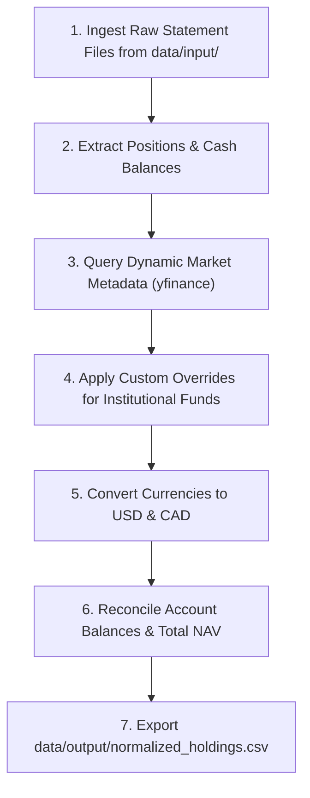

# Portfolio Normalization Specification

This specification defines the objective and scope, user-provided inputs, multi-source ingestion protocol, dynamic metadata enrichment, multi-currency normalization mathematics, reconciliation procedure, and output deliverable format for standardizing disparate financial holdings into a unified dataset within `financial-bot`.

---

## 1. Objective & Scope

The Portfolio Normalization process converts heterogeneous raw financial data from multiple institutions, account types, and currencies into a single, canonical, auditable holding dataset.

### Core Objectives:
1. **Multi-Source Ingestion**: Ingest statements across multiple brokerages, employer retirement plans, and direct crypto holdings.
2. **Cash & Liquidity Standardization**: Extract and normalize all uninvested cash and settlement balances per account and currency.
3. **Account & Tax Metadata Resolution**: Join account identifiers with canonical ownership and tax treatment categories (`Taxable`, `Tax-Free`, `Tax-Deferred`).
4. **Dynamic Market Enrichment**: Derive security metadata dynamically via market data APIs without static ticker dictionaries.
5. **Dual-Currency Valuation**: Convert market value, cost basis, and unrealized profit/loss into standard dual base currencies (USD and CAD).
6. **Reconciliation & Quality Control**: Ensure row-level records reconcile exactly with statement Net Asset Values (NAVs).
7. **Deliverable Production**: Export the final normalized dataset to `data/output/normalized_holdings.csv`.

---

## 2. Required Input

Defines what the **user** must provide to the system prior to running portfolio normalization.

### 2.1 Source Statements & Data Files (in `data/input/`)
- **Statement Types**: Raw statement files across institutions, including:
  - Brokerage monthly activity statements or position exports (CSV, PDF).
  - Employer group retirement plan summaries (e.g., Manulife, 401(k) / RRSP portals).
  - Crypto exchange exports or wallet position summaries.
  - Bank cash / savings balance summaries.
- **Coverage**: All active accounts, uninvested cash / settlement balances, security quantities, and cost basis.
- *Note: Formats and column headers naturally vary across institutions; ingestion parsers in Process handle standardization.*

### 2.2 User Parameters & Assumptions
- **Account Metadata Mapping**: Account names, beneficiary owners, account types (`TFSA`, `RRSP`, `Margin`, `401(k)`, `HSA`), and tax categories (`Taxable`, `Tax-Free`, `Tax-Deferred`).
- **Institutional Fund Proxies**: Details / descriptions of unlisted employer retirement funds (e.g., internal fund code matching a benchmark index).
- **Target Base Currencies**: Reporting base currencies (defaults to `USD` and `CAD`).

---

## 3. Process

Defines the complete end-to-end technical, enrichment, currency conversion, and reconciliation workflow.

### 3.1 Multi-Source Ingestion & Cash Handling
- Ingest source files from `data/input/` using dedicated modular parsers (e.g., `src/core/parsers/ibkr.py`, `src/core/parsers/manulife.py`).
- Map records to the intermediate `Position` model (`source`, `account_id`, `symbol`, `asset_category`, `currency`, `quantity`, `cost_basis`, `close_price`, `market_value`, `unrealized_pl`).
- **Cash & Liquidity Standardization**:
  - Uninvested cash, money market deposits, and settlement balances are represented as distinct line items:
    - `symbol`: `f"{currency}.CASH"` (e.g., `USD.CASH`, `CAD.CASH`).
    - `asset_name`: `f"{currency} Cash / Settlement"`.
    - `asset_class`: `"Cash & Equivalents"`, `asset_subclass`: `"Cash"`.
    - `quantity`: equal to reported cash balance, `close_price_local`: `1.0`.

### 3.2 Account Metadata & Tax Regime Mapping
- Join account identifiers with canonical metadata:
  - **Taxable**: Non-registered accounts, margin accounts, taxable corporate accounts.
  - **Tax-Free**: Canadian TFSA, US Roth IRA, Roth 401(k), Health Savings Accounts (HSA).
  - **Tax-Deferred**: Canadian RRSP, Spousal RRSP, DPSP, LIRA, RRIF; US Traditional 401(k), Traditional IRA.

### 3.3 Dynamic Metadata Enrichment & Classification Engine
> [!IMPORTANT]
> **Zero Static Ticker Dictionaries**: Do not hardcode static ticker lists in code. Classify securities dynamically via market data APIs.

1. **Dynamic API Resolution**:
   - Query external market data APIs (e.g., `yfinance.Ticker(symbol).info`).
   - Extract `shortName`/`longName`, `quoteType`, `category`, `sector`, `industry`, `country`.
2. **Asset Class Taxonomy**:
   - **Digital Assets**: `category` contains `Digital Assets`/`Crypto`, or `quoteType == "CRYPTOCURRENCY"`.
   - **Canadian Equities**: `country == "Canada"`, symbol ends with `.TO`/`.V`, or currency is `CAD`.
   - **International Equities**: `category` contains `Foreign`, `International`, `Emerging`, `Europe`, `Pacific`, or `Global`.
   - **US Equities**: US-domiciled equity or broad index ETF.
   - **Fixed Income**: Bond funds, treasuries, aggregate fixed income ETFs.
   - **Cash & Equivalents**: Cash and currency settlement balances.
3. **GICS Sector Normalization**:
   - Normalize into the 11 standard GICS sectors (`Technology`, `Communication Services`, `Consumer Cyclical`, `Consumer Defensive`, `Financial Services`, `Healthcare`, `Industrials`, `Energy`, `Utilities`, `Real Estate`, `Basic Materials`).
4. **Unlisted Institutional Funds Resolution**:
   - Inject benchmark proxy parameters via `custom_overrides` for employer retirement funds without public tickers.

### 3.4 Multi-Currency Normalization Mathematics
Convert all financial metrics into dual base currencies (USD and CAD):
- Obtain exchange rate $R_{CAD \to USD}$ (value of 1 CAD in USD) and $R_{USD \to CAD} = \frac{1}{R_{CAD \to USD}}$.
- **USD Positions**:
  $$\text{market\_value\_usd} = \text{market\_value\_local}, \quad \text{market\_value\_cad} = \frac{\text{market\_value\_local}}{R_{CAD \to USD}}$$
- **CAD Positions**:
  $$\text{market\_value\_usd} = \text{market\_value\_local} \times R_{CAD \to USD}, \quad \text{market\_value\_cad} = \text{market\_value\_local}$$
- **Other Currencies**:
  $$\text{market\_value\_usd} = \text{market\_value\_local} \times R_{\text{CURR} \to USD}, \quad \text{market\_value\_cad} = \frac{\text{market\_value\_usd}}{R_{CAD \to USD}}$$

### 3.5 Balance Reconciliation & Quality Control
- **Account NAV Cross-Check**:
  $$\sum_{h \in \text{Holdings}(A)} \text{market\_value\_usd}(h) \approx \text{StatementEndingNAV}(A) \quad (\text{tolerance } \pm \$1.00)$$
- **Portfolio NAV Reconciliation**: Sum of all normalized holdings must equal sum of all statement ending NAVs.
- **Unresolved Security Audit**: Verify zero unclassified or missing asset records.

### 3.6 Standard Operating Procedure (SOP)


1. Inspect raw statements in `data/input/`.
2. Execute normalization script in `data/tmp/normalize_portfolio.py` via `uv run`.
3. Verify account balance reconciliation in console logs.
4. Export normalized dataset to `data/output/normalized_holdings.csv`.

---

## 4. Output Template

Defines the output deliverables generated in `data/output/`.

### 4.1 Data Deliverable (`data/output/normalized_holdings.csv`)

The normalization stage produces a canonical CSV dataset adhering strictly to the schema below:

```csv
source,account_id,account_label,owner,account_type,tax_treatment,symbol,asset_name,asset_class,asset_subclass,sector,industry,currency,quantity,close_price_local,cost_basis_local,market_value_local,unrealized_pl_local,market_value_usd,cost_basis_usd,unrealized_pl_usd,market_value_cad,cost_basis_cad,unrealized_pl_cad
```

### 4.2 Target Field Definitions

| Field Name | Type | Description | Example |
| :--- | :--- | :--- | :--- |
| `source` | string | Source institution or statement identifier | `IBKR`, `Manulife` |
| `account_id` | string | Normalized account key | `U14660817/taxable`, `MANULIFE/rrsp` |
| `account_label` | string | Human-readable display label | `Primary Taxable Account` |
| `owner` | string | Beneficiary owner name | `Primary Holder`, `Joint` |
| `account_type` | string | Account category | `TFSA`, `RRSP`, `Margin`, `401(k)` |
| `tax_treatment` | string | Tax regime (`Taxable`, `Tax-Free`, `Tax-Deferred`) | `Tax-Deferred` |
| `symbol` | string | Ticker symbol or fund identifier | `AAPL`, `SPYM`, `USD.CASH` |
| `asset_name` | string | Descriptive security name | `Apple Inc.`, `US Cash / Settlement` |
| `asset_class` | string | High-level asset class | `US Equities`, `Digital Assets`, `Cash & Equivalents` |
| `asset_subclass` | string | Granular security type | `Individual Stock`, `Broad Index ETF`, `Cash` |
| `sector` | string | GICS sector or asset category | `Technology`, `Cash` |
| `industry` | string | Industry group or benchmark index | `Semiconductors`, `S&P 500 Index` |
| `currency` | string | Denominated currency of the position | `USD`, `CAD` |
| `quantity` | float | Number of shares, units, or crypto tokens | `150.0` |
| `close_price_local` | float | Unit market price in denominated currency | `220.50` |
| `cost_basis_local` | float | Total cost basis in denominated currency | `25000.00` |
| `market_value_local`| float | Total market value in denominated currency | `33075.00` |
| `unrealized_pl_local`| float| Unrealized profit/loss in denominated currency | `8075.00` |
| `market_value_usd` | float | Total market value converted to USD | `33075.00` |
| `cost_basis_usd` | float | Total cost basis converted to USD | `25000.00` |
| `unrealized_pl_usd` | float | Unrealized profit/loss in USD | `8075.00` |
| `market_value_cad` | float | Total market value converted to CAD | `45535.00` |
| `cost_basis_cad` | float | Total cost basis converted to CAD | `34418.00` |
| `unrealized_pl_cad` | float | Unrealized profit/loss in CAD | `11117.00` |
