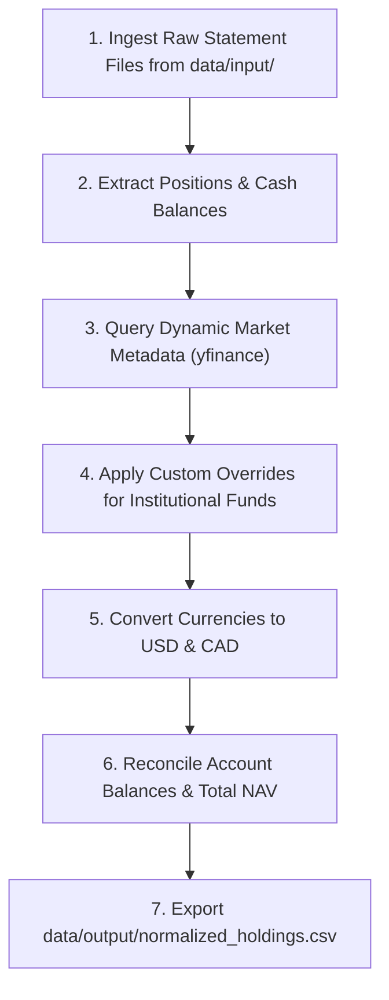

# Portfolio Normalization Specification

This specification defines the schema, multi-source ingestion protocol, dynamic metadata enrichment, multi-currency normalization mathematics, and data reconciliation procedure for standardizing disparate financial holdings into a unified dataset within `financial-bot`.

---

## 1. Objective & Scope

The Portfolio Normalization process converts heterogeneous raw financial data from multiple institutions, account types, and currencies into a single, canonical, auditable holding dataset.

### Core Objectives:
1. **Multi-Source Ingestion**: Ingest statements across multiple brokerages (e.g., IBKR, Questrade, Wealthsimple, Schwab, Fidelity), employer retirement plans (e.g., Manulife, 401(k) administrators), and direct crypto holdings.
2. **Cash & Liquidity Standardization**: Extract and normalize all uninvested cash and settlement balances per account and currency.
3. **Account & Tax Metadata Resolution**: Join account identifiers with canonical ownership and tax treatment categories (`Taxable`, `Tax-Free`, `Tax-Deferred`).
4. **Dynamic Market Enrichment**: Derive security metadata (name, quote type, asset class, subclass, GICS sector, industry, country) dynamically via market data APIs without static ticker dictionaries.
5. **Dual-Currency Valuation**: Convert market value, cost basis, and unrealized profit/loss into standard dual base currencies (USD and CAD) using verified exchange rates.
6. **Reconciliation & Quality Control**: Ensure row-level records reconcile exactly with statement Net Asset Values (NAVs).
7. **Deliverable Production**: Export the final normalized dataset to `data/output/normalized_holdings.csv`.

---

## 2. Target Normalized Holding Schema

All raw positions and cash balances must be transformed into the **Target Normalized Holding Schema** prior to downstream analytics or reporting.

### 2.1 Schema Definition

| Field Name | Type | Description | Example |
| :--- | :--- | :--- | :--- |
| `source` | string | Source institution or statement identifier | `IBKR`, `Manulife`, `Wealthsimple` |
| `account_id` | string | Normalized account key or sub-account identifier | `U14660817/taxable`, `MANULIFE/rrsp` |
| `account_label` | string | Human-readable account label | `Primary Taxable Account` |
| `owner` | string | Account owner / beneficiary name | `Primary Holder`, `Joint` |
| `account_type` | string | Account category | `TFSA`, `RRSP`, `Margin`, `401(k)` |
| `tax_treatment` | string | Tax regime (`Taxable`, `Tax-Free`, `Tax-Deferred`) | `Tax-Deferred` |
| `symbol` | string | Ticker symbol or fund identifier | `AAPL`, `SPYM`, `ML_8322`, `USD.CASH` |
| `asset_name` | string | Descriptive legal security name | `Apple Inc.`, `S&P 500 Index Fund` |
| `asset_class` | string | High-level asset class (see Section 5.2) | `US Equities`, `Digital Assets` |
| `asset_subclass` | string | Granular security type (see Section 5.2) | `Individual Stock`, `Broad Index ETF` |
| `sector` | string | GICS sector or asset category (see Section 5.3) | `Technology`, `Cash` |
| `industry` | string | Industry group or benchmark index | `Semiconductors`, `S&P 500 Index` |
| `currency` | string | Denominated currency of the position | `USD`, `CAD` |
| `quantity` | float | Number of shares, units, or crypto tokens | `150.0` |
| `close_price_local` | float | Unit market price in denominated currency | `220.50` |
| `cost_basis_local` | float | Total cost basis in denominated currency | `25000.00` |
| `market_value_local`| float | Total market value in denominated currency | `33075.00` |
| `unrealized_pl_local`| float| Unrealized profit/loss in denominated currency | `8075.00` |
| `market_value_usd` | float | Total market value converted to USD | `33075.00` |
| `cost_basis_usd` | float | Total cost basis converted to USD | `25000.00` |
| `unrealized_pl_usd` | float | Unrealized profit/loss in USD | `8075.00` |
| `market_value_cad` | float | Total market value converted to CAD | `45535.00` |
| `cost_basis_cad` | float | Total cost basis converted to CAD | `34418.00` |
| `unrealized_pl_cad` | float | Unrealized profit/loss in CAD | `11117.00` |

---

## 3. Multi-Source Ingestion & Cash Handling

### 3.1 Raw Position Parsing
- Ingest source files from `data/input/` using dedicated modular parsers (e.g., `src/core/parsers/ibkr.py`, `src/core/parsers/manulife.py`).
- Map records to the intermediate `Position` model:
  - `source`: Institution name.
  - `account_id`: Account number or sub-account identifier.
  - `symbol`: Primary ticker, fund code, or cash symbol.
  - `asset_category`: `Equity`, `ETF`, `Mutual Fund`, `Crypto`, `Fixed Income`, `Cash`.
  - `currency`: ISO 3-letter currency code (`USD`, `CAD`, `EUR`, `GBP`, etc.).
  - `quantity`: Number of units held.
  - `cost_basis`: Total purchase cost in position currency.
  - `close_price`: Closing market price per unit.
  - `market_value`: Total valuation in position currency (`quantity * close_price` or reported value).
  - `unrealized_pl`: `market_value - cost_basis`.

### 3.2 Cash & Liquidity Standardization
- Uninvested cash, money market deposits, and settlement balances must be extracted from account summaries and represented as distinct line items.
- Standardized cash line attributes:
  - `symbol`: `f"{currency}.CASH"` (e.g., `USD.CASH`, `CAD.CASH`).
  - `asset_name`: `f"{currency} Cash / Settlement"`.
  - `asset_class`: `"Cash & Equivalents"`.
  - `asset_subclass`: `"Cash"`.
  - `sector`: `"Cash"`.
  - `industry`: `"Cash & Money Market"`.
  - `quantity`: Equal to `market_value_local`.
  - `close_price_local`: `1.0`.
  - `cost_basis_local`: Equal to `market_value_local`.
  - `market_value_local`: Reported cash balance.
  - `unrealized_pl_local`: `0.0`.

---

## 4. Account Metadata & Tax Classification

Raw statements often contain only cryptic account numbers. The normalization process joins each account ID with canonical account metadata.

### 4.1 Account Metadata Structure
Each account is mapped via an `Account` definition containing:
- `account_id`: Unique identifier (e.g., `U14660817/taxable`, `MANULIFE/group-rrsp`).
- `name`: Legal account name.
- `owner`: Beneficiary / individual owner name (or `Joint`).
- `account_type`: Specific account category (e.g., `TFSA`, `RRSP`, `Margin Individual`, `Cash`, `401(k)`).
- `tax_treatment`: Standardized tax regime (`Taxable`, `Tax-Free`, `Tax-Deferred`).
- `label`: Clean display label for reporting.
- `base_currency`: Primary currency of the account.

### 4.2 Tax Regimes
- **Taxable**: Non-registered accounts, margin accounts, taxable joint accounts, corporate operating accounts.
- **Tax-Free**: Canadian TFSA, US Roth IRA, Roth 401(k), Health Savings Accounts (HSA).
- **Tax-Deferred**: Canadian RRSP, Spousal RRSP, DPSP, LIRA, RRIF; US Traditional 401(k), Traditional IRA, SEP-IRA.

---

## 5. Dynamic Metadata Enrichment & Classification Engine

> [!IMPORTANT]
> **Zero Static Ticker Dictionaries**: Do not hardcode static ticker lists or sector dictionaries in code or specifications. Classify securities dynamically via market data APIs.

### 5.1 Dynamic API Resolution
For all unique public symbols:
1. Query market data APIs (e.g., Yahoo Finance via `yfinance.Ticker(symbol).info`).
2. Retrieve dynamic attributes:
   - `shortName` / `longName` -> `asset_name`.
   - `quoteType` -> `EQUITY`, `ETF`, `MUTUALFUND`, `CRYPTOCURRENCY`.
   - `category` -> Fund classification (e.g., `Large Growth`, `Digital Assets`, `Foreign Large Blend`).
   - `sector` & `industry` -> Standard GICS classification.
   - `country` -> Country of primary listing / incorporation.

### 5.2 Asset Class & Subclass Taxonomy
- **Digital Assets**:
  - Condition: `category` contains `Digital Assets`/`Crypto`, name contains `Bitcoin`/`Ethereum`, or `quoteType == "CRYPTOCURRENCY"`.
  - `asset_class = "Digital Assets"`, `asset_subclass = "Crypto ETF"` (or `"Direct Crypto"`), `sector = "Digital Assets"`.
- **Canadian Equities**:
  - Condition: `country == "Canada"`, symbol ends with `.TO`/`.V`, or currency is `CAD` for equity/ETF.
  - `asset_class = "Canadian Equities"`, `asset_subclass = "Individual Stock"` (or `"ETF"`).
- **International Equities**:
  - Condition: `quoteType == "ETF"` and `category` contains `Foreign`, `International`, `Emerging`, `Europe`, `Pacific`, or `Global`.
  - `asset_class = "International Equities"`, `asset_subclass = "Broad Index ETF"` (or `"International Stock"`).
- **US Equities**:
  - Condition: US-domiciled equity or ETF.
  - `asset_class = "US Equities"`.
  - Subclass rule:
    - Broad market benchmark (`Large Blend`, `Large Growth`, `Large Value`, `Mid-Cap`, `Small Cap`) -> `asset_subclass = "Broad Index ETF"`.
    - Sector/Thematic ETF (`Semiconductors`, `Clean Energy`, `Financials`) -> `asset_subclass = "Sector ETF"`.
    - Individual company equity -> `asset_subclass = "Individual Stock"`.
- **Fixed Income & Bonds**:
  - Condition: Bond funds, treasuries, aggregate fixed income ETFs.
  - `asset_class = "Fixed Income"`, `asset_subclass = "Bond ETF"` (or `"Government Bond"`).
- **Cash & Equivalents**:
  - `asset_class = "Cash & Equivalents"`, `asset_subclass = "Cash"`.

### 5.3 GICS Sector Normalization
Normalize raw sector strings into the 11 standard GICS sectors:
1. `Technology` (Information Technology, Semiconductors, Software, Hardware)
2. `Communication Services` (Telecommunications, Interactive Media, Internet)
3. `Consumer Cyclical` (Consumer Discretionary, Retail, Automotive)
4. `Consumer Defensive` (Consumer Staples, Food, Personal Products)
5. `Financial Services` (Banking, Asset Management, Insurance)
6. `Healthcare` (Pharmaceuticals, Biotechnology, Medical Devices)
7. `Industrials` (Aerospace, Defense, Logistics, Industrial Machinery)
8. `Energy` (Oil & Gas Exploration, Refining, Clean Energy Infrastructure)
9. `Utilities` (Electric, Water, Gas Utilities, Renewable Power)
10. `Real Estate` (REITs, Real Estate Management)
11. `Basic Materials` (Chemicals, Mining, Forestry, Metals)

### 5.4 Unlisted Institutional & Private Funds Resolution
Employer retirement plans often use internal fund codes (e.g., `ML_8322`, `ML_8321`) that cannot be queried via public market tickers.
- **Benchmark Index Proxy Resolution**:
  1. Inspect plan documents or fund profile URLs to identify the tracked index benchmark (e.g., BlackRock S&P 500 Index, MSCI EAFE Index).
  2. Pass custom configuration mappings via a `custom_overrides` dictionary to the enricher:
     ```python
     custom_overrides = {
         "ML_8322": {
             "name": "ML BR U.S. Equity Index i4 (BlackRock S&P 500)",
             "asset_class": "US Equities",
             "asset_subclass": "Index Mutual Fund",
             "sector": "Broad Market / Diversified",
             "industry": "S&P 500 Index",
         }
     }
     ```

---

## 6. Multi-Currency Normalization Mathematics

To enable unified portfolio aggregation, all financial values must be converted into dual base currencies (USD and CAD).

### 6.1 Exchange Rate Parameter
- Obtain the FX rate from statement metadata (e.g., IBKR statement conversion rate) or query real-time exchange rates (`USDCAD=X`).
- Define:
  - $R_{CAD \to USD}$: Value of 1 CAD in USD (e.g., `0.72635`).
  - $R_{USD \to CAD} = \frac{1}{R_{CAD \to USD}}$ (e.g., `1.37675`).

### 6.2 Deterministic Valuation Formulas

#### Case A: Position Currency is USD
$$\text{market\_value\_usd} = \text{market\_value\_local}$$
$$\text{cost\_basis\_usd} = \text{cost\_basis\_local}$$
$$\text{unrealized\_pl\_usd} = \text{unrealized\_pl\_local}$$
$$\text{market\_value\_cad} = \frac{\text{market\_value\_local}}{R_{CAD \to USD}}$$
$$\text{cost\_basis\_cad} = \frac{\text{cost\_basis\_local}}{R_{CAD \to USD}}$$
$$\text{unrealized\_pl\_cad} = \frac{\text{unrealized\_pl\_local}}{R_{CAD \to USD}}$$

#### Case B: Position Currency is CAD
$$\text{market\_value\_usd} = \text{market\_value\_local} \times R_{CAD \to USD}$$
$$\text{cost\_basis\_usd} = \text{cost\_basis\_local} \times R_{CAD \to USD}$$
$$\text{unrealized\_pl\_usd} = \text{unrealized\_pl\_local} \times R_{CAD \to USD}$$
$$\text{market\_value\_cad} = \text{market\_value\_local}$$
$$\text{cost\_basis\_cad} = \text{cost\_basis\_local}$$
$$\text{unrealized\_pl\_cad} = \text{unrealized\_pl\_local}$$

#### Case C: Other Currencies (e.g., EUR, GBP, JPY)
$$\text{market\_value\_usd} = \text{market\_value\_local} \times R_{\text{CURR} \to USD}$$
$$\text{cost\_basis\_usd} = \text{cost\_basis\_local} \times R_{\text{CURR} \to USD}$$
$$\text{unrealized\_pl\_usd} = \text{unrealized\_pl\_local} \times R_{\text{CURR} \to USD}$$
$$\text{market\_value\_cad} = \frac{\text{market\_value\_usd}}{R_{CAD \to USD}}$$
$$\text{cost\_basis\_cad} = \frac{\text{cost\_basis\_usd}}{R_{CAD \to USD}}$$
$$\text{unrealized\_pl\_cad} = \frac{\text{unrealized\_pl\_usd}}{R_{CAD \to USD}}$$

---

## 7. Data Quality & Balance Reconciliation

Before exporting the normalized dataset, execute automated reconciliation checks:

1. **Account NAV Cross-Check**:
   For each account $A$:
   $$\sum_{h \in \text{Holdings}(A)} \text{market\_value\_usd}(h) \approx \text{StatementEndingNAV}(A)$$
   *(Tolerance threshold: $\pm \$1.00$ to accommodate rounding)*
2. **Portfolio Total NAV Reconciliation**:
   $$\sum_{\text{All } h} \text{market\_value\_usd}(h) = \sum_{\text{All } A} \text{StatementEndingNAV}(A)$$
3. **Unresolved Security Audit**:
   - Flag any record with `asset_class == "Unknown"` or `sector == "Other"`.
   - Ensure all public tickers were resolved successfully via API.

---

## 8. Standard Operating Procedure (SOP)



1. **Inspect Raw Statements**: Scan `data/input/` for brokerage CSVs, institutional exports, and text summaries.
2. **Execute Ingestion Script**:
   - Execute the normalization script in `data/tmp/normalize_portfolio.py` using `uv`:
     ```bash
     uv run python data/tmp/normalize_portfolio.py
     ```
3. **Verify Balance Reconciliation**:
   - Confirm in terminal logs that total portfolio valuation matches statement totals.
4. **Generate CSV Deliverable**:
   - Write standard output file: `data/output/normalized_holdings.csv`.
   - Ensure CSV headers adhere strictly to Section 2.1.

---

## 9. Output Deliverable Contract

The normalization stage produces a single standardized CSV file: `data/output/normalized_holdings.csv`.

### CSV Field Order
```csv
source,account_id,account_label,owner,account_type,tax_treatment,symbol,asset_name,asset_class,asset_subclass,sector,industry,currency,quantity,close_price_local,cost_basis_local,market_value_local,unrealized_pl_local,market_value_usd,cost_basis_usd,unrealized_pl_usd,market_value_cad,cost_basis_cad,unrealized_pl_cad
```
